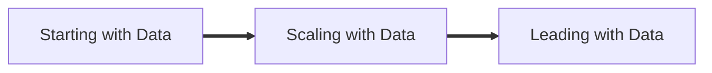

## Defining Data Engineering

Their definition:

> Data engineering is the development, implementation, and maintenance of systems
> and processes that take in raw data and produce high-quality, consistent information
> that supports downstream use cases, such as analysis and machine learning. Data engi‐
> neering is the intersection of security, data management, DataOps, data architecture,
> orchestration, and software engineering. A data engineer manages the data engineering
> lifecycle, beginning with getting data from source systems and ending with serving
> data for use cases, such as analysis or machine learning.

## Data Engineering Lifecycle

## The History of Data Engineering

They document a history which moved through Big Data into the modern data architectures. Focusing on the role of the Data Engineering (DE) as the process of creating the foundation from which data analysis (DA) and data science (DS) rest.

## The Relationship between DE, DS, and DA

[SOURCE](https://hackernoon.com/the-ai-hierarchy-of-needs-18f111fcc007)

They argue that DEs will spend most of their time working in the lower half of the pyramid. 

> [!NOTE]
> I wonder to what degree these types of diagrams are useful. In reality the relationships between these different actions is more complex than a pyramid. 
> This critique has been leveled against many overtly hierarchical relationships in favor of more "networked" or web-like relational mappings.
> How would this change the way we thinking about dependencies in decisions regarding data architectures?

## DE skills and activities

Across the DE lifecycle decisions need to be made regard how to balance diverse values.

Axes of value:
- cost
- agility
- scalability
- simplicity
- reuse
- interoperability

## Fostering Data Maturity

>**Data Maturity:** is the progression toward higher data utilization, capabilities, and integration across the organization.

Their data maturity model is similar to many others. 

### Starting with Data

Getting started with data should focus on:
- Getting buy-in from stakeholders, ideally higher level management.
    - Look for a sponsor
- Defining the right architecture
    - Define the value add first, then find the right tool
- Find the data
- Build the foundation
    - This requires structure and process

Potential Pitfalls:
- Getting quick wins is important for building buy-in, but may incur technical debt. Have a plan for addressing it.
- Focusing on the nitty-gritty of data foundation can lead to tunnel vision. Maintain connections with domain leaders and subject experts. Make tools that people with use.
- At this point, use off-the-shelf solutions. Avoid technical complexity. 
- Custom builds only when necessary. 

GOAL: Move beyond adhoc data requests to formalized data practices.

### Scaling with Data

Scaling with data should focus on:
- Document and formalize processes. 
- Establish data architecture.
- Integrate DevOps and DataOps.
- Begin laying groundwork for ML.
- Continue to resist the desire for custom builds

Potential Pitfalls:
- Avoid the desire to be technologically driven instead of value driven.
- Focus on solutions managing the team. The main barrier is not technology at this point, it is the data team. 
- Educate domain leaders and subject matter experts on the practical uses of data. Avoid over promising.
    - Do the work of bringing people into the data world through outreach and education.

GOAL: Self-service analytics and automated pipelines.

### Leading with Data

Leading with Data should focus on:
- Increasing automation and introduction of new data.
- Building custom tools to create value.
- Better data governance and DataOps
- Increasing use of data through deploying tools that expose data and metadata
- Increased collaboration with analysis, science, and ML process.
- Building community around leveraging data. Inspire creativity. 

Pitfalls:
- Fight complacency. Establish continuous improvement plans.
- Avoid hobby projects. Create value. 

> [!NOTE]
> Overall, a few things stand out in their data maturity model. 
> 1. The focus on avoid custom build is throughout, even in stage 3. 
> 2. The human-work is central, and a potential source of problems throughout the model. 
>    - Getting buy-in early
>    - Working with people to find where you can create value.
>    - Spurring use through education.
>    - Maintain growth through continued creative use of data.

## Skills of a DE

Required knowledge for DE:

- "Data Aware"
- Data Management best practices
- Technical tools and software, including the benefits of each
- DataOps
- Software engineering
- Data architecture
- DA and DS requirements
- Understand needs from business (organizational) and technical lense

### Business Responsibilities

> A successful data engineer always zooms out to understand the big picture and
> how to achieve outsized value for the business. Communication is vital, both for
> technical and nontechnical people. We often see data teams succeed based on their
> communication with other stakeholders; success or failure is rarely a technology
> issue.

- Know how to communicate with nontechnical and technical people.
- Understand how to scope and gather business and product requirements.
- Understand the cultural foundations of Agile, DevOps, and DataOps.
- Control costs.
- Learn continuously.

> [!NOTE]
> I wonder what difference would be included if this section was written not for private business
> but for public sector and non-profit DE. Cost still matter but working within a grant funded and
> highly regulated environment may be different. 

### Technical Responsibilities

- Proficiency in at least SQL, Python, bash, and probably some others. 
- Knowledge of available tools and their benefits

### Type A and Type B DEs

Type A for Abstraction. These engineers focus on building data infrastructure at an abstract level using off-the-shelf tools and software. 

Type B for Build. These engineers are focused on building custom tools and software for leveraging a companies key advantages. 

## Working in Organizations

### Internal-facing and External-facing DEs

DEs interface with both internal and external data users, and need to consider the needs of both. 

> An external-facing data engineer typically aligns with the users of external-facing
> applications, such as social media apps, Internet of Things (IoT) devices, and ecom‐
> merce platforms.

> An internal-facing data engineer typically focuses on activities crucial to the needs of
> the business and internal stakeholders (Figure 1-11). Examples include creating and
> maintaining data pipelines and data warehouses for BI dashboards, reports, business
> processes, data science, and ML models.

### Interfacing with other technical roles

> The data engineer is a hub between **data producers**, such as software engineers, data
> architects, and DevOps or site-reliability engineers (SREs), and **data consumers**, such
> as data analysts, data scientists, and ML engineers. 

#### Upstream Data Stakeholders

**Data architects**

> Data architects design the blueprint for organizational data
> management, mapping out processes and overall data architecture and systems. 
> They also serve as a bridge between an organization’s technical and nontechnical sides. 
> Successful data architects generally have “battle scars” from extensive engineering 
> experience, allowing them to guide and assist engineers while successfully communicating
> engineering challenges to nontechnical business stakeholders.'

The role of the data architect is to design and implement a data ecosystem with the help of data engineers. 

**Software Engineers**

> Software engineers build the software and systems that run a
> business; they are largely responsible for generating the internal data that data engi‐
> neers will consume and process.

> A data engineer should work together with software engineers to understand the
> applications that generate data, the volume, frequency, and format of the generated
> data, and anything else that will impact the data engineering lifecycle, such as data
> security and regulatory compliance.

In situations where there is little to know custom software, this won't be as significant. In both situations, a single person may plan all these roles in some sense. 

**DevOps**

> DevOps and SREs often produce data through operational monitoring.

#### Downstream Data Stakeholders

These are the data users and use cases. 

**Data Scientist**

>  If data engineers do their job and collaborate successfully, data scientists
> shouldn’t spend their time collecting, cleaning, and preparing data after initial explor‐
> atory work. Data engineers should automate this work as much as possible.

It is this pressure to do good data science that gave birth to data engineering. In order for scientists to be effective it requires they
have the foundation and tools to excel.

Good data engineering also requires that engineers work iteratively with scientists to facilitate exploration and discovery. 

Data scientist are doing science. They should be running tests and experiments. 

> [!NOTE]
> I appreciate the points in which the art and creativity of data work comes through in this book. There really is 
> a sense that when we get these things right we can start to really work well as a team, and also begin to ask more
> interesting questions and tell more compelling stories, hopefully really making change.

**Data Analyst**

> Data analysts’ subject-matter expertise is invaluable in
> improving data quality, and they frequently collaborate with data engineers in this
> capacity.

Analyst dig deep into data, often focused on a particular domain or subject matter. They may be using data to derive insights into what happened and various alternatives. 

It is important that engineers take the understanding and expertise of the analyst into consideration as they design the data system.

**Modellers and ML and AI Engineers**

The scope of this work is rapidly changing, but ML and AI models need to be trained on clean and robust data and lots of it. There are specifics that apply only
to the development of AI tools, but by and large the data maturity that is required for AI should also benefit other forms of data science. 

### Working with Business Leadership

**CEO**

Vision Setter. DE will share what is possible with the data available and potential new data.

**CIO**

Internal-facing IT executive. Establish major tech initiatives, CIOs often establish data culture.

**CTO**

External-facing IT executive. Apps, web, IoT. May also act as the CIO. DE may report directly to the CTO.

**CDO**

Oversees data products, strategy, initiatives, and core functions. Sometimes will manage business analytics and data engineering.

**CAO**

Variant of CDO focused on analytics and data science. 

